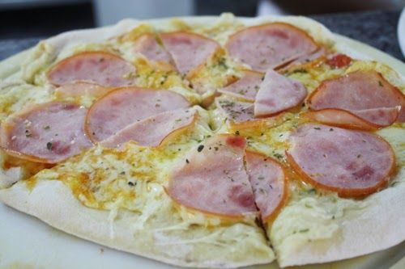
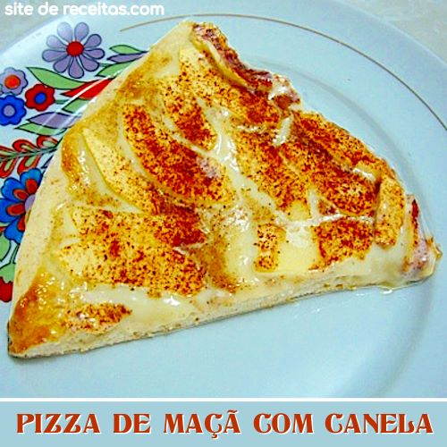

# Cardápio
Atividade para criação de um cardápio simples
<!DOCTYPE html>
<html lang="pt-br">

<head>
    <meta charset="UTF-8">
    <meta name="viewport" content="width=device-width, initial-scale=1.0">
    <meta name="author" content="isabel Cristina"
    <title><strong>SABORES DE PIZZA FIT</strong></title>

</head>

<h1>ISA PIZZAS FIT, SAUDÁVEIS E SABOROSAS</h1>
 
<h2>Pizza de massa de grão de bico, recheio de alho poró, tomate seco, ervilhas e champignon </h2>

 
Incluir a farinha de grão-de-bico em sua receita aumentará o valor nutricional da receita.

 
 Além de um prato saboroso e especial,você terá uma opção saudável e livre de glúten e lactose.

    
<h2> Pizza de massa de tapioca, com recheio de peito de peru, ricota e muzzarela</h2>

Tapioca é um ingrediente excelente para substituir a farinha de trigo nas receitas.

Além de trazer valor nutritivo ao prato.

<h2> Pizza com massa de batata doce, recheio de maçã e banana cozidas com canela</h2>

 A batata-doce é cheia de benefícios para quem está de dieta, com baixas calorias e ótima para  dar 
sensação de saciedade.
   

 Pode ser recheada com seus ingredientes preferidos e terá um resultado final bem semelhante às pizzas tradicionais.

<h3> Preços promocionais de inauguração. Preço:R$30,00.Levando duas pizzas pague apenas R$50,00,
    <b>Contatos via whatsapp:15(976865024)Sorocaba e região.
    
    </b>
    Podemos personalizar seu recheio.

</h3>    

</body>

</html>
